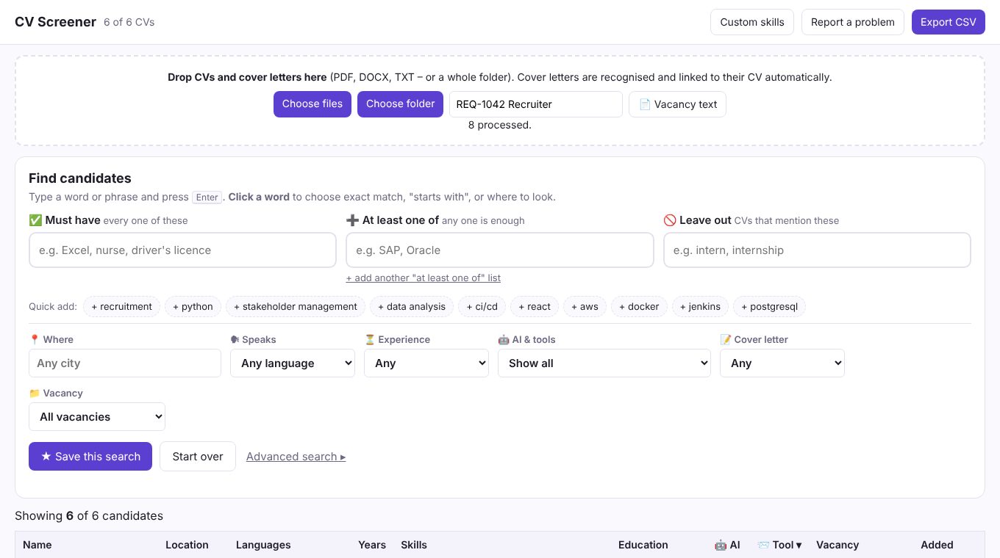
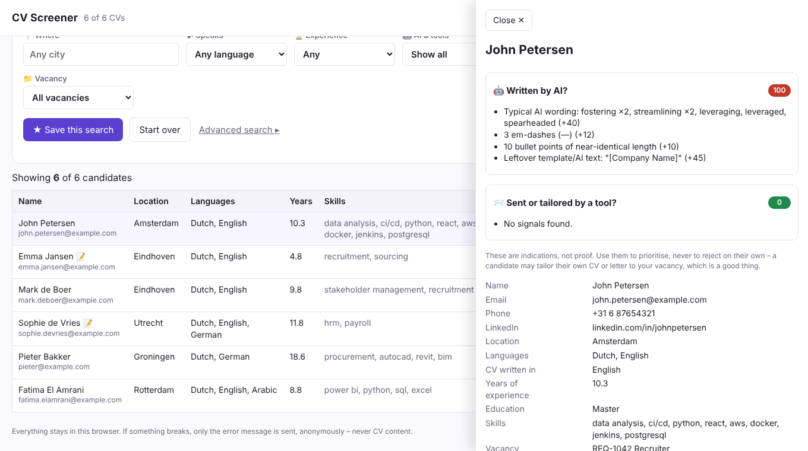

# CV Screener

Chrome extension for screening large volumes of CVs on top of any ATS (Oleeo and others).

- **Parses** PDF, DOCX and TXT into name, contact details, location, languages, skills, years of experience and education level.
- **Two separate AI checks**, each scored 0–100 with its reasons. 🤖 *Was it written by AI?* 📨 *Was it sent or rewritten per vacancy by an auto-apply tool?* The second compares the CV against the pasted vacancy text and against other applications. Both are indicators, not proof.
- **Cover letters**: recognised automatically, linked to their CV (email, name, ATS capture or file name), searchable, and checked for AI writing and auto-apply signals (same letter with names swapped, shared templates, addressed to another job).
- **Typo-tolerant search** (*managment* finds *management*, and the other way round) with *Did you mean…?*
- **Filters and sorts** on every one of those fields, and exports the filtered list to CSV.
- **Guided search** for non-technical users (Must have / At least one of / Leave out boxes; click a word for exact, starts-with or field-only matching; several either/or lists; a plain-English summary; quick-add skills, plain dropdowns, a helpful no-results message) plus an advanced syntax (`skill:python years:>=5 -intern`), saved searches and highlighted matches.
- **Captures** a candidate straight from the open ATS page, using the recruiter's own session.
- **Runs locally.** CVs never leave the browser, and there is no API key or cost. Only anonymous error reports are sent; they become GitHub issues in this repo.



| Why a CV scores high | Popup in the browser |
|---|---|
|  |  |

More: [cover letter](docs/screenshots/14-cover-letter.png) · [AI vs tool](docs/screenshots/12-ai-and-tool.png) · [vacancy text](docs/screenshots/11-vacancy-text.png) · [typos](docs/screenshots/13-typos.png) · [guided search](docs/screenshots/7-custom-search.png) · [word options](docs/screenshots/10-word-options.png) · [no results helper](docs/screenshots/9-no-results-help.png) · [highlighted matches](docs/screenshots/8-search-highlight.png) · [filtered](docs/screenshots/2-filtered.png) · [download page](docs/screenshots/5-download-page.png) · [on a phone](docs/screenshots/6-download-page-mobile.png). Regenerate with `node tools/screenshots.mjs`.

| For | Read |
|---|---|
| Testers | https://cv-screener-lilac.vercel.app · [docs/INSTALL.md](docs/INSTALL.md) |
| Owner: hosting and error reports | [docs/SETUP.md](docs/SETUP.md) |

```
extension/          the Chrome extension (MV3, no build step)
  lib/parse.js      text -> candidate fields
  lib/aiscore.js    written-by-AI heuristics
  lib/tailor.js     sent/tailored-by-a-tool heuristics
  lib/doctype.js    CV or cover letter, and linking letters to CVs
  lib/dict.js       skills, cities, languages, AI phrase lists
  capture.js        reads the open ATS tab
site/               Vercel: download page + /api/report -> GitHub issue
test/               node:test unit tests     tools/e2e.mjs  full extension in Chromium
```
